## Composable Batch Files (CBF)

. . . are Windows Batch Scripting files that are function-based, modularized and easy 
to use and understand.

Better and more Comprehensive Tutorials can be found at:

https://en.wikibooks.org/wiki/Windows_Batch_Scripting

https://www.tutorialspoint.com/batch_script/index.htm

## Bottom Line Up Front

The function is the conceptual building block of composable batch files (cbf). A batch file 
should be composed of functions like the following.

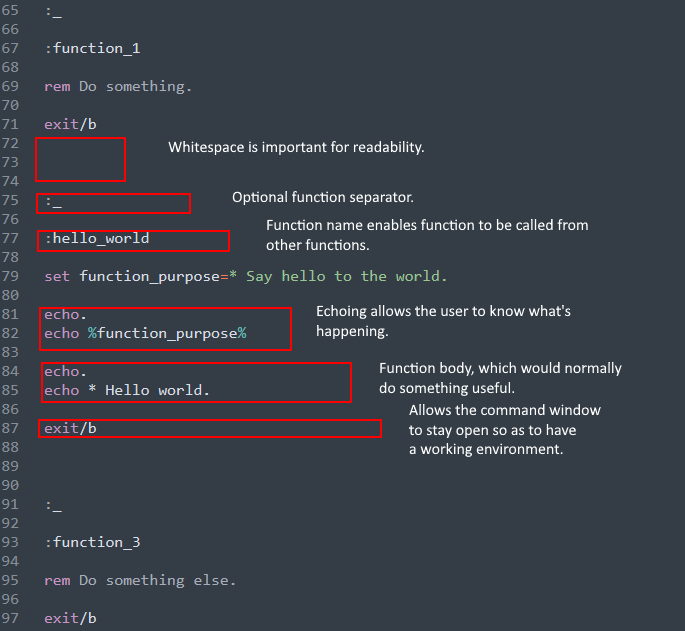

## Table of Contents

Part I - The Problem: Many batch files have spaghetti code.

Part II - The Answer in my opinion is functionalization.

Part III - How customization can increase your productivity.

Part IV - Setting Up the Repository.

## Part I - The Problem? Most Batch Files Are A Mess

Most batch files I've seen in the wild are pretty messy. They are often quite long and not 
well structured. I know this partly because I've written hundreds of them. For years I wrote 
batch files that were big balls of mud. I like to think I'm a little better now.

For Example, I googled "typical batch file" and this was the first hit:

https://www.instructables.com/id/5-Cool-Batch-Files/

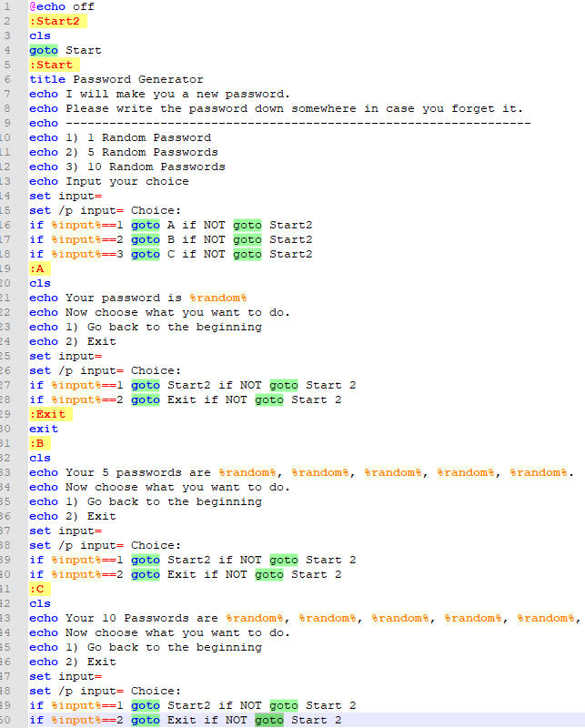

I don't know about you, but trying to figure out this control flow gives me a headache. This 
small file has 19 goto statements! And it's not even that bad compared to many I've seen. A 
goto statemnent is not necessarily bad form. It's a matter of how easy the code is to follow.

## Part II - Solution is to How to Modularize? Functionalization.

So let's impose some structure. In most programming languages there's a concept of a 
function.

At the heart of Composable Batch Files is enforcing the use of traditional functions or code 
blocks.

#### Anatomy of a function.

Here are the basic structural elements:

**_[label]_** = function name (which must be unique)

**_call :[label]_** = function call to another function in this batch file.

**_goto [label]_** = also a function call, which does not return to the caller.

**_call [batch2] [label]_** = call to another batch file function.

**_exit/b_** - end of function. The lack of exit/b is the most common culprit. Without ending 
functions, you have spaghetti code.

## A More Structured and Functionalized Approach

Building the batch file around the a set of functions can turn a normally disorganized 
environment into a structured and organized one.

## Hello World - Functionalized

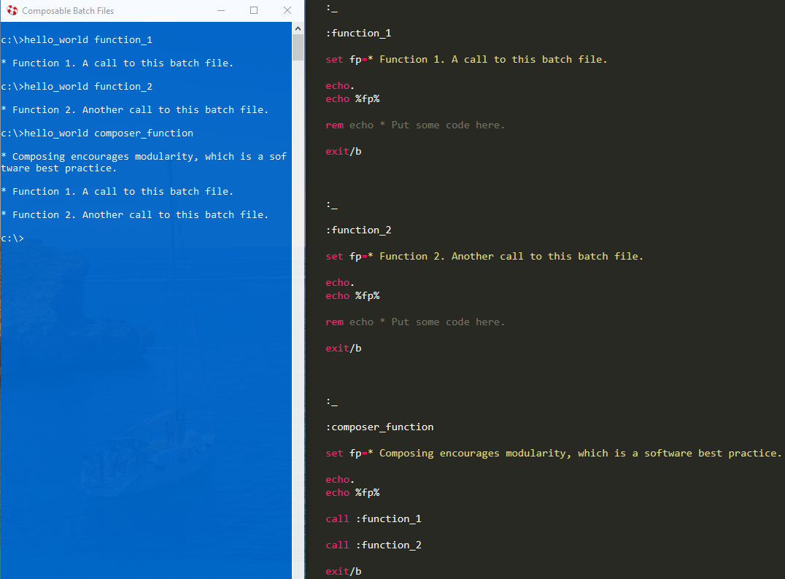

## Part III - Customize CBF by Leveraging and Recycling Environment Variables

Besides functionalization, another feature CBF promotes is leveraging and recycling 
environment variables in order to personalize your CBF user experience. This is achieved by 
**_mapping_** nicknames/function names to environment variables. There is a CBF file named 
n.bat (Nicknames Dictionary) whose sole purpose is to do this mapping. For example, in n.bat, 
you could add a function with the nickname/function name of "docs" which maps the Documents 
folder to the cbf_path environment variable. Then because another batch file td.bat (Transform 
Directory) makes use of this mapping, typing "td docs" would navigate to the documents folder.

Creating a mapping function can be thought of as creating a bookmark for file system 
locations, websites and filenames. N.bat can be thought of of a place to store properties you 
wish to repeatedly leverage. Then other bach files and functions you write are the methods
that can access those properties/dictionary definitions.

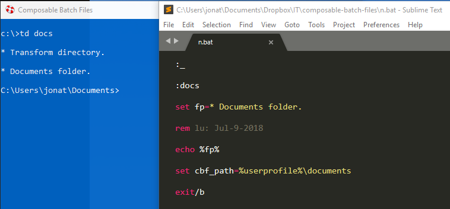

#### A few more customization examples.

Since of.bat (Open Folder) also leverages the "cbf-path" environment variable, typing "of 
docs" would open the documents folder in Windows Explorer.

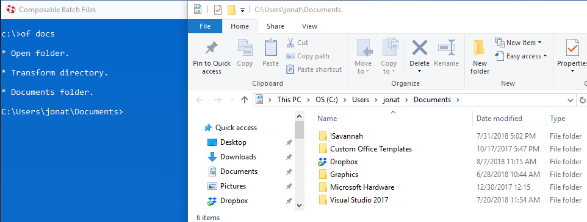

Sf.bat (Surf) leverages the "cbf-url" environment variable. So typing "sf cnn" would surf to 
the cnn website.

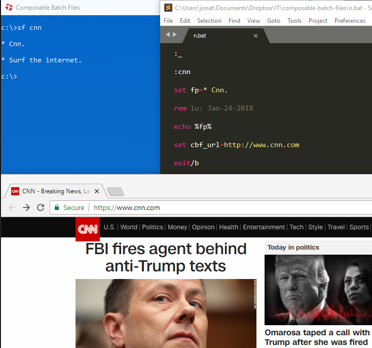

No.bat (Notepad) leverages the "cbf-fn" environment variable. So typing "no gett" would 
open the file with the nickname, "gett", which is the Gettysburg Address.

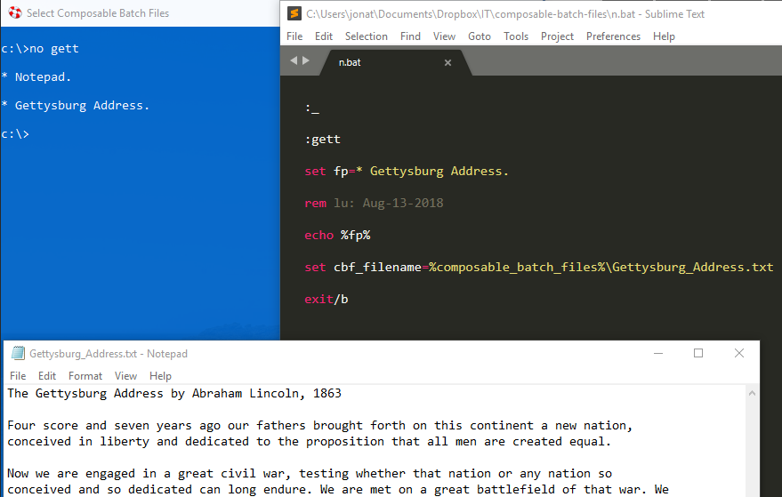

So by adding new nickname functions to n.bat, you could customize your environment to make 
folders, websites and filenames you often use to be very easily accessible.

### Now run them all together with "m compose".

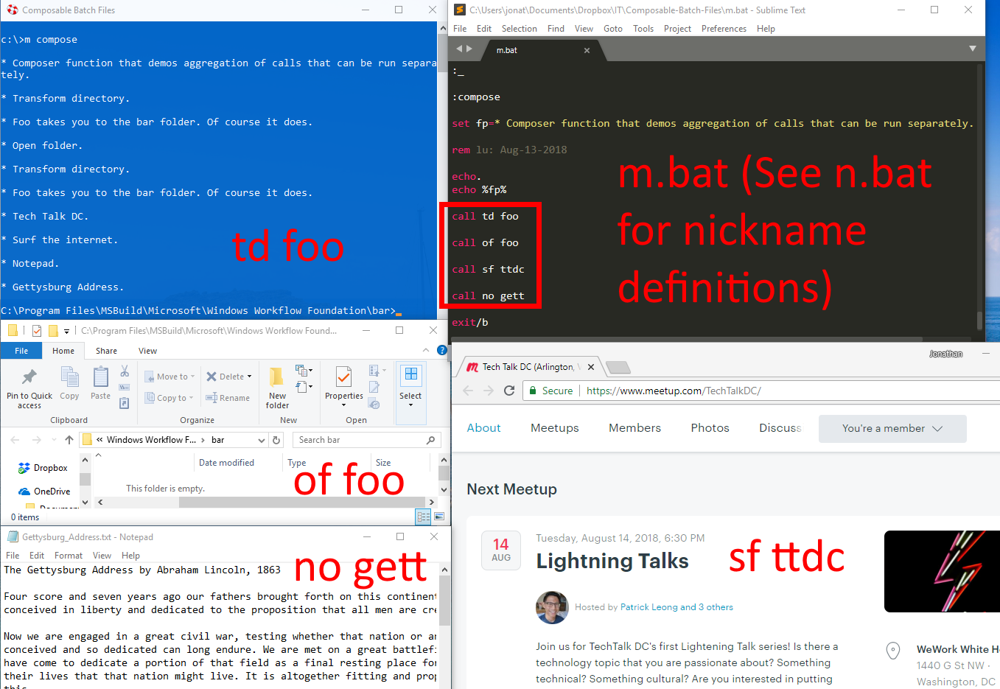

## Part IV - Repository Setup Instructions

Add %COMPOSABLE_BATCH_FILES% as an environment variable or, at least, add it to your path to 
where you installed the repository.

If you so choose, also add these environment variables for the following:

* %CBF-DEFAULT-BROWSER%

* %CBF-DEFAULT-TEXT-EDITOR%

* %CBF-DEFAULT-REPOSITORY-FOLDER%

For example, here's an example of some CBF environment variables:

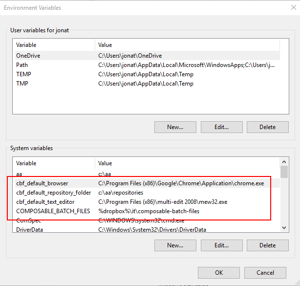

After you have cloned or downloaded the CBF repository, double click the shortcut titled 
"Composable Batch Files Helper" to open up a blue command prompt. If you have the environment 
variables set, there is no need to use the blue command prompt, unless you want to. Any 
command prompt will do.

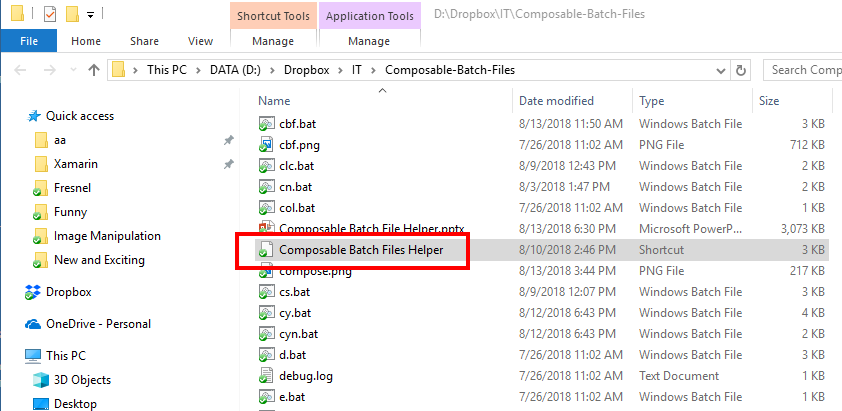

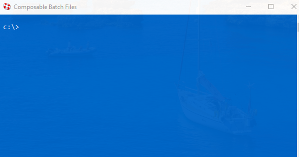

### Starting with a Fresh Dictionary

If you wish to start with a fresh dictionary file, do the following:

* Rename n.bat to something else.

* Rename n_emp.bat to n.bat.

Presto. You now have an empty dictionary.

### Menu

All of the batch files in CBF use a functionalized, modular approach. To see a menu of all the 
available CBFs type "menu" or "cbf" at the prompt.

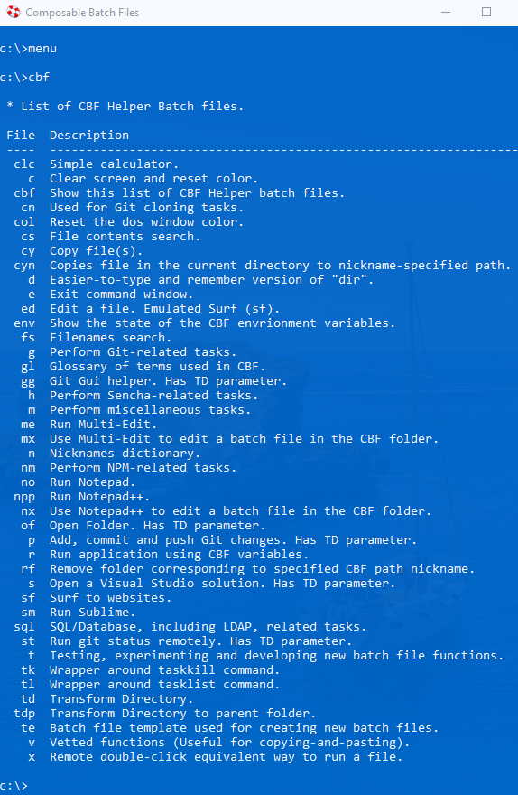

### Getting Help

To get help with a particular batch file, at the prompt type "[batch file name]/?". For 
example:

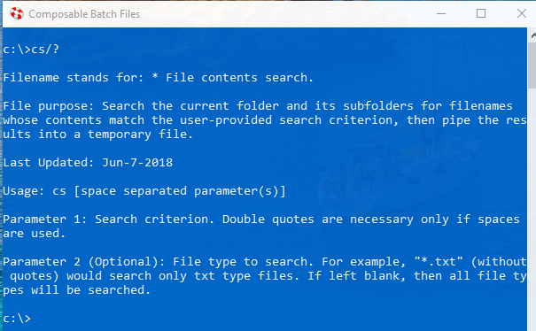

There is also a PowerPoint presentation, which similar too this Readme file, for this 
repository located in this repository at CBF.pptx.

### Batch File Structures

In the batch file collection here, as Apr-19-2019, there are about 6 types of structures used:

* %1 - the new functions should be at the bottom of the file.

* main_function - should be at the very bottom of batch file.

* preprocessor - implies a top-to-bottom control flow starting at the preprocessor entry 
point.

* code_execution_area - implies a top-to-bottow control flow starting at the 
code_execution_area entry point. The newest functions should be at the bottom of the file.

* %1/code_execution_area hybrid - Goes to the code_execution_area unless a percent 1 is 
provided.

* custom goto - usually leverage a parameterless call to perform some default functionality.
